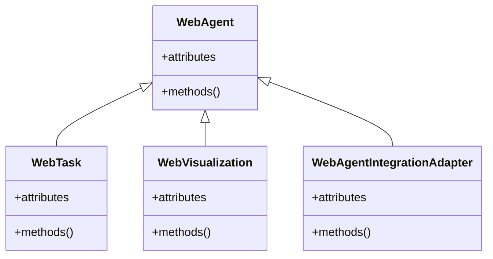

# web_agent_adapter - Class Diagram

```mermaid
classDiagram

    class WebAgent {
        +methods()
        +attributes
    }

    class WebTask {
        +methods()
        +attributes
    }

    class WebVisualization {
        +methods()
        +attributes
    }

    class WebAgentIntegrationAdapter {
        +methods()
        +attributes
    }

    WebAgent <|-- WebTask
    WebAgent <|-- WebVisualization
    WebAgent <|-- WebAgentIntegrationAdapter
```
