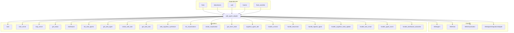

# web_agent_adapter - Architectural Flowchart

```mermaid
graph TD
    M[web_agent_adapter]

    subgraph "Classes"
        C0[WebAgent]
        C1[WebTask]
        C2[WebVisualization]
        C3[WebAgentIntegrationAdapter]
    end

    M --> C0
    M --> C1
    M --> C2
    M --> C3
    subgraph "Functions"
        F0[main]
        F12[start_server]
        F13[stop_server]
        F16[get_status]
        F17[dashboard]
        F18[list_web_agents]
        F19[get_web_agent]
        F20[create_web_task]
        F21[get_web_task]
        F22[web_cognitive_synthesize]
        F23[list_visualizations]
        F24[create_visualization]
        F25[get_mesh_state]
        F26[cognitive_agent_sdk]
        F27[handle_connect]
        F28[handle_disconnect]
        F29[handle_register_agent]
        F30[handle_cognitive_state_update]
        F31[handle_task_result]
        F32[handle_agent_event]
        F33[handle_dashboard_subscribe]
    end

    M --> F0
    M --> F12
    M --> F13
    M --> F16
    M --> F17
    M --> F18
    M --> F19
    M --> F20
    M --> F21
    M --> F22
    M --> F23
    M --> F24
    M --> F25
    M --> F26
    M --> F27
    M --> F28
    M --> F29
    M --> F30
    M --> F31
    M --> F32
    M --> F33
    subgraph "Dependencies"
        D0[flask]
        D1[dataclasses]
        D2[uuid]
        D3[futures]
        D4[flask_socketio]
    end

    D0 --> M
    D1 --> M
    D2 --> M
    D3 --> M
    D4 --> M
```
