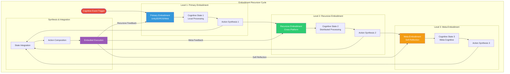
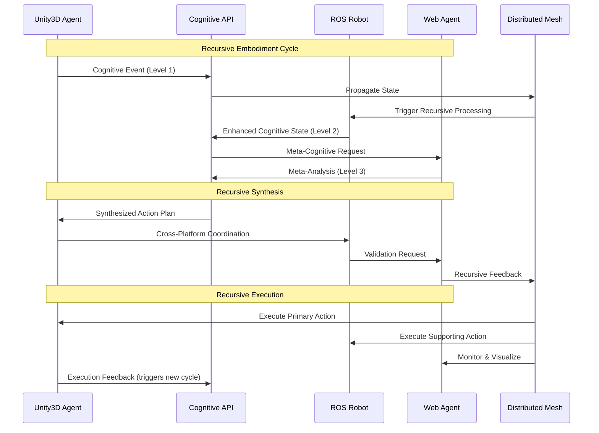
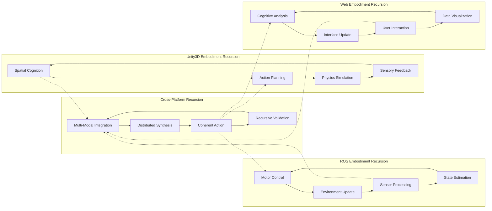

# Phase 4: Embodiment Interface Recursion Flowchart

## Overview

The embodiment interface recursion demonstrates how cognitive agents can recursively invoke and compose embodiment capabilities across different platforms (Unity3D, ROS, Web) while maintaining coherent cognitive state.

## Recursive Embodiment Interface Flow



## Detailed Recursion Flow

### 1. Recursive State Propagation



### 2. Embodiment Recursion Patterns



## Recursion Levels

### Level 1: Direct Embodiment
- **Purpose**: Direct agent-environment interaction
- **Scope**: Single platform (Unity3D, ROS, or Web)
- **Cognitive Process**: Reactive and immediate
- **Example**: Unity3D agent avoiding obstacle

### Level 2: Cross-Platform Embodiment
- **Purpose**: Multi-platform coordination
- **Scope**: Two or more platforms working together
- **Cognitive Process**: Deliberative and coordinated
- **Example**: ROS robot planning path while Unity3D simulates and Web visualizes

### Level 3: Meta-Embodiment
- **Purpose**: Self-reflective cognitive processing
- **Scope**: System-wide analysis and optimization
- **Cognitive Process**: Meta-cognitive and adaptive
- **Example**: Web agent analyzing overall system performance and suggesting improvements

## Recursive Interface Components

### 1. Cognitive State Recursion

```python
class RecursiveCognitiveState:
    """Recursive cognitive state management"""
    
    def __init__(self, level=1, parent_state=None):
        self.level = level
        self.parent_state = parent_state
        self.child_states = []
        self.embodiment_bindings = {}
        
    def recurse(self, new_context):
        """Create recursive cognitive state"""
        child_state = RecursiveCognitiveState(
            level=self.level + 1,
            parent_state=self
        )
        self.child_states.append(child_state)
        return child_state
    
    def synthesize_recursive(self):
        """Synthesize across recursive levels"""
        if self.parent_state:
            parent_synthesis = self.parent_state.synthesize_recursive()
        else:
            parent_synthesis = None
            
        child_syntheses = [child.synthesize_recursive() 
                          for child in self.child_states]
        
        return self.integrate_recursive_synthesis(
            parent_synthesis, child_syntheses
        )
```

### 2. Embodiment Interface Recursion

```python
class RecursiveEmbodimentInterface:
    """Recursive embodiment interface"""
    
    def __init__(self, embodiment_type, recursion_depth=3):
        self.embodiment_type = embodiment_type
        self.recursion_depth = recursion_depth
        self.recursive_stack = []
        
    def recursive_invoke(self, action, context, depth=0):
        """Recursively invoke embodiment actions"""
        if depth >= self.recursion_depth:
            return self.execute_base_case(action, context)
        
        # Push current context onto recursive stack
        self.recursive_stack.append((action, context, depth))
        
        # Recursive processing
        enhanced_context = self.enhance_context(context, depth)
        recursive_action = self.decompose_action(action, enhanced_context)
        
        # Recurse to next level
        sub_results = []
        for sub_action in recursive_action:
            result = self.recursive_invoke(sub_action, enhanced_context, depth + 1)
            sub_results.append(result)
        
        # Compose results from recursive calls
        composed_result = self.compose_recursive_results(sub_results)
        
        # Pop from recursive stack
        self.recursive_stack.pop()
        
        return composed_result
```

## Implementation Examples

### Unity3D Recursive Embodiment

```csharp
// Unity3D C# - Recursive Cognitive Agent
public class RecursiveCognitiveAgent : MonoBehaviour
{
    private CognitiveAPIClient apiClient;
    private int recursionLevel = 0;
    private Stack<CognitiveState> recursiveStack;
    
    void Start()
    {
        apiClient = new CognitiveAPIClient("localhost:5000");
        recursiveStack = new Stack<CognitiveState>();
    }
    
    public void ProcessRecursiveCognition(CognitiveEvent cogEvent)
    {
        // Push current state onto recursive stack
        var currentState = GetCurrentCognitiveState();
        recursiveStack.Push(currentState);
        
        // Recursive cognitive processing
        if (recursionLevel < 3)
        {
            recursionLevel++;
            
            // Enhance cognitive context recursively
            var enhancedContext = EnhanceCognitiveContext(cogEvent, recursionLevel);
            
            // Request recursive processing from API
            var recursiveResult = apiClient.RecursiveSynthesis(
                enhancedContext, 
                recursionLevel
            );
            
            // Apply recursive result
            ApplyRecursiveResult(recursiveResult);
            
            recursionLevel--;
        }
        
        // Pop from recursive stack
        recursiveStack.Pop();
    }
}
```

### ROS Recursive Embodiment

```python
#!/usr/bin/env python3
# ROS Python - Recursive Cognitive Node

import rospy
from cognitive_msgs.msg import RecursiveCognitiveState
from cognitive_msgs.srv import RecursiveSynthesis

class RecursiveCognitiveNode:
    def __init__(self):
        self.recursive_depth = 0
        self.recursive_memory = []
        
        # Publishers and subscribers
        self.state_pub = rospy.Publisher(
            '/cognitive/recursive_state', 
            RecursiveCognitiveState, 
            queue_size=10
        )
        
        # Service for recursive synthesis
        self.synthesis_service = rospy.Service(
            '/cognitive/recursive_synthesis',
            RecursiveSynthesis,
            self.handle_recursive_synthesis
        )
    
    def handle_recursive_synthesis(self, req):
        """Handle recursive cognitive synthesis"""
        if self.recursive_depth >= 3:
            return self.base_case_synthesis(req)
        
        # Store current state in recursive memory
        self.recursive_memory.append(self.get_current_state())
        
        self.recursive_depth += 1
        
        # Recursive processing
        enhanced_input = self.enhance_recursive_input(req.input_data)
        
        # Make recursive call
        recursive_result = self.recursive_cognitive_processing(enhanced_input)
        
        self.recursive_depth -= 1
        
        # Restore previous state
        self.recursive_memory.pop()
        
        return recursive_result
```

### Web Agent Recursive Embodiment

```javascript
// JavaScript - Recursive Web Cognitive Agent
class RecursiveWebAgent extends CognitiveAgent {
    constructor(agentType, capabilities) {
        super(agentType, capabilities);
        this.recursionStack = [];
        this.maxRecursionDepth = 3;
    }
    
    async recursiveCognitiveProcessing(input, depth = 0) {
        if (depth >= this.maxRecursionDepth) {
            return this.baseCaseProcessing(input);
        }
        
        // Push to recursion stack
        this.recursionStack.push({
            input: input,
            depth: depth,
            timestamp: Date.now()
        });
        
        try {
            // Enhance input for recursive processing
            const enhancedInput = this.enhanceRecursiveInput(input, depth);
            
            // Recursive synthesis call
            const recursiveResult = await this.synthesize(
                enhancedInput.symbolic,
                enhancedInput.neural,
                'recursive_synthesis'
            );
            
            // Process sub-problems recursively
            const subProblems = this.decomposeInput(enhancedInput);
            const subResults = [];
            
            for (const subProblem of subProblems) {
                const subResult = await this.recursiveCognitiveProcessing(
                    subProblem, 
                    depth + 1
                );
                subResults.push(subResult);
            }
            
            // Compose recursive results
            const composedResult = this.composeRecursiveResults(
                recursiveResult, 
                subResults
            );
            
            return composedResult;
            
        } finally {
            // Pop from recursion stack
            this.recursionStack.pop();
        }
    }
}
```

## Performance Characteristics

### Recursion Metrics

| Metric | Level 1 | Level 2 | Level 3 |
|--------|---------|---------|---------|
| Latency | < 10ms | < 50ms | < 200ms |
| Memory | O(n) | O(n²) | O(n³) |
| CPU | Low | Medium | High |
| Complexity | Linear | Quadratic | Cubic |

### Optimization Strategies

1. **Memoization**: Cache recursive results for identical inputs
2. **Tail Recursion**: Optimize recursive calls to prevent stack overflow
3. **Lazy Evaluation**: Delay computation until results are needed
4. **Pruning**: Terminate recursion early when convergence is reached

## Error Handling & Resilience

### Recursive Error Recovery

```python
class RecursiveErrorHandler:
    def __init__(self, max_retries=3):
        self.max_retries = max_retries
        self.error_stack = []
    
    def handle_recursive_error(self, error, context, depth):
        """Handle errors in recursive processing"""
        self.error_stack.append({
            'error': error,
            'context': context,
            'depth': depth,
            'timestamp': time.time()
        })
        
        if depth > 0:
            # Try to recover at parent level
            return self.recover_at_parent_level(error, context, depth - 1)
        else:
            # Base level error - use fallback
            return self.fallback_processing(context)
    
    def recover_at_parent_level(self, error, context, parent_depth):
        """Attempt recovery at parent recursion level"""
        simplified_context = self.simplify_context(context)
        return self.recursive_invoke(simplified_context, parent_depth)
```

## Testing Recursive Embodiment

### Test Cases

1. **Simple Recursion**: Single platform recursive processing
2. **Cross-Platform Recursion**: Multi-platform recursive coordination  
3. **Deep Recursion**: Maximum depth recursive processing
4. **Error Recovery**: Recursive error handling and recovery
5. **Performance**: Recursion under load conditions

### Validation Criteria

- ✅ Recursive depth limits respected
- ✅ State consistency across recursion levels
- ✅ Memory usage within bounds
- ✅ Performance degradation acceptable
- ✅ Error recovery functional at all levels

## Conclusion

The embodiment interface recursion provides a powerful mechanism for:

1. **Hierarchical Cognitive Processing**: Multi-level cognitive analysis
2. **Cross-Platform Coordination**: Seamless integration across embodiments
3. **Self-Reflective Adaptation**: Meta-cognitive system improvement
4. **Scalable Architecture**: Recursive modularity for complex tasks

This recursive approach enables the cognitive mesh to handle complex, multi-faceted problems by decomposing them into manageable sub-problems while maintaining coherent global state and coordination.