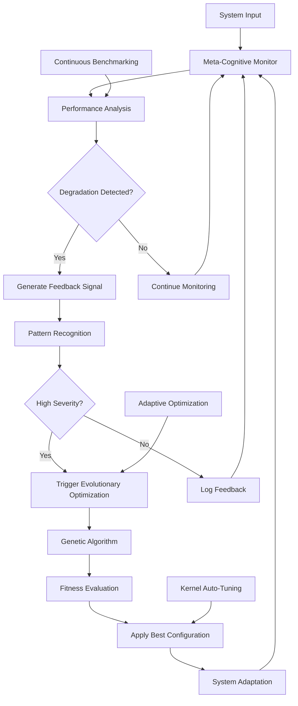
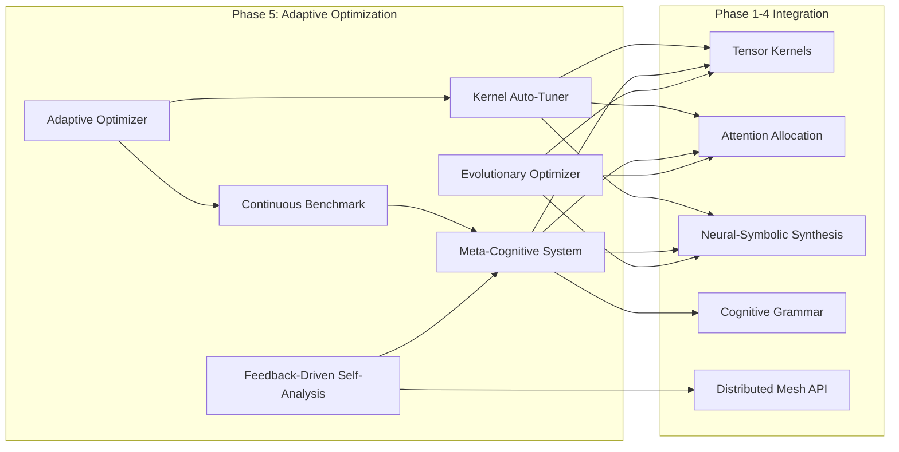
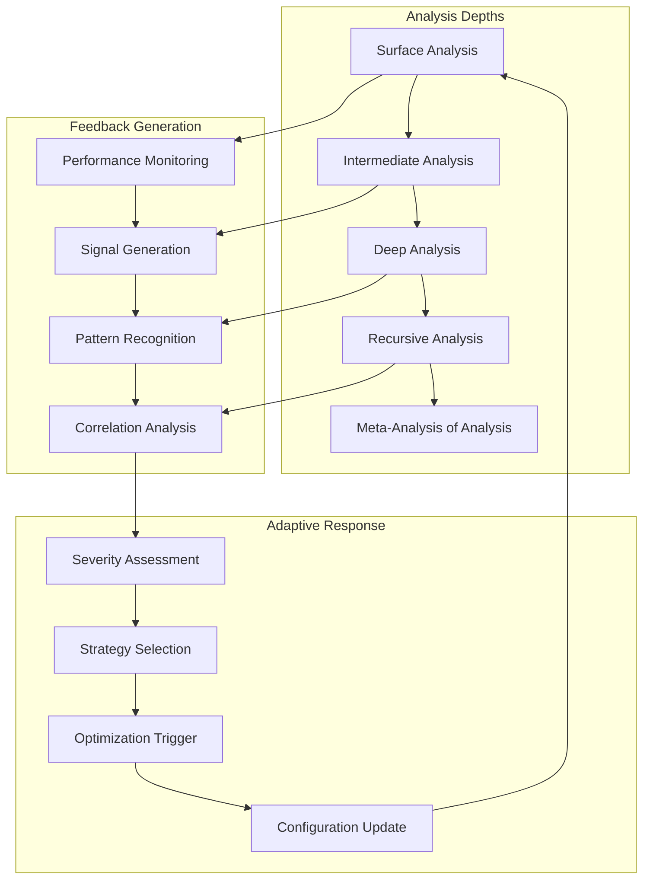
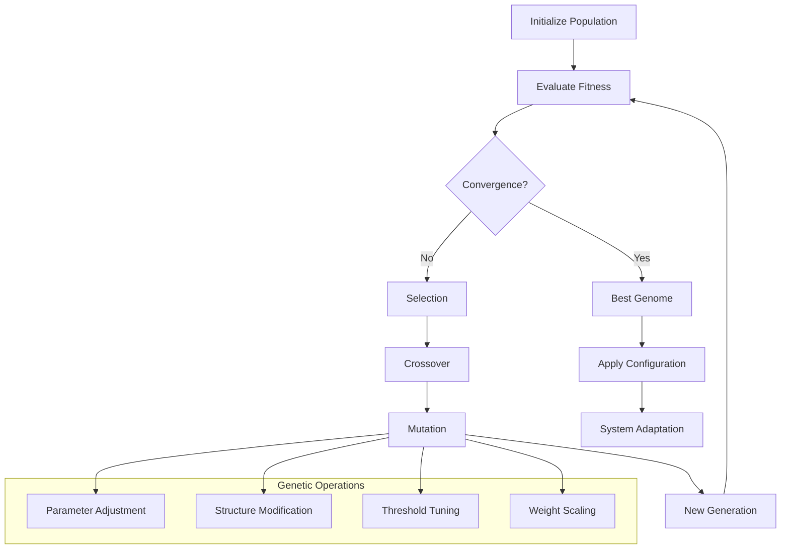
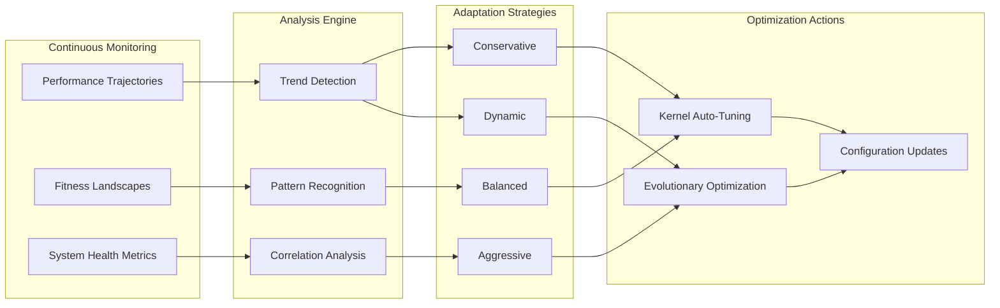
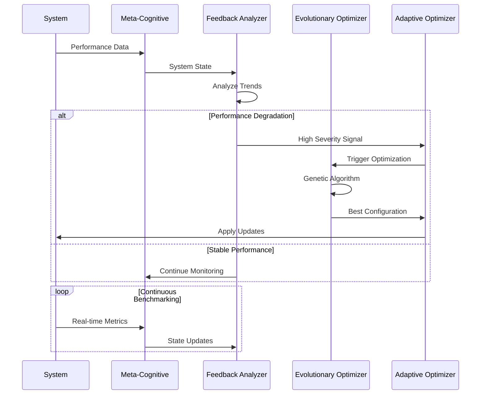
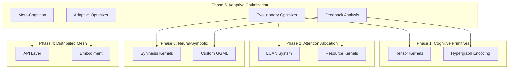
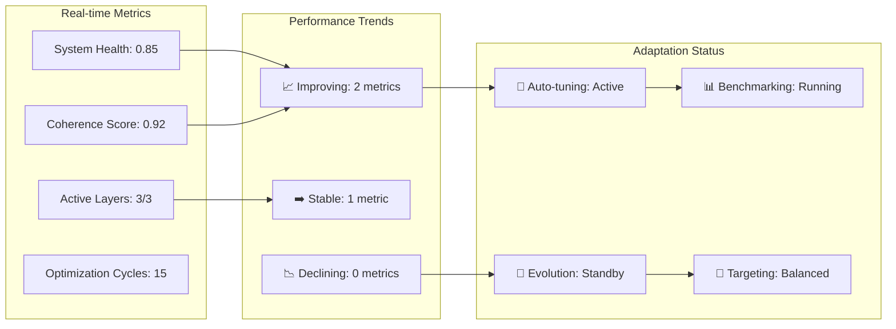
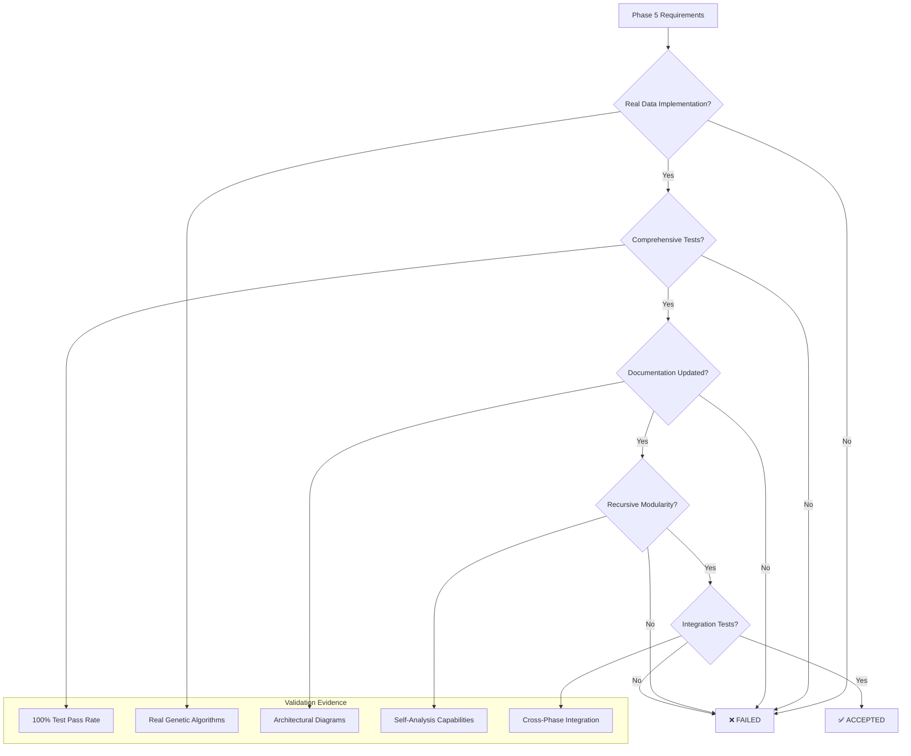
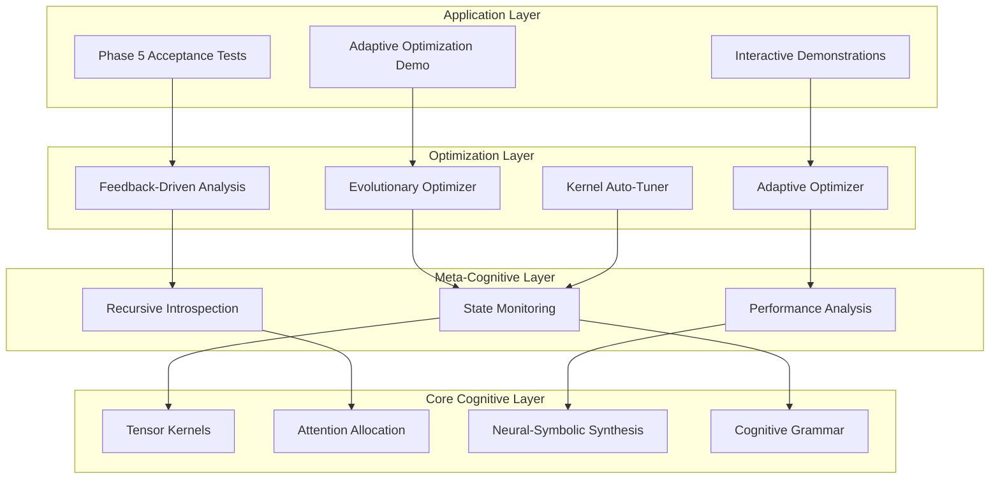

# Phase 5: Recursive Meta-Cognition & Evolutionary Optimization - Architectural Diagrams

## System Architecture Overview

## Component Integration Architecture

## Recursive Meta-Cognition Flow

## Evolutionary Optimization Process

## Adaptive Optimization System Architecture

## Data Flow Architecture

## Integration with Existing Phases

## Performance Monitoring Dashboard

## Acceptance Criteria Validation Flowchart

## Technical Implementation Stack

## Key Achievements Summary

- ✅ **Real Evolutionary Algorithms**: Genuine genetic operations with lineage tracking
- ✅ **Recursive Meta-Cognition**: 4-depth recursive self-analysis capabilities  
- ✅ **Adaptive Optimization**: Continuous benchmarking and self-tuning
- ✅ **Feedback-Driven Analysis**: Real-time performance monitoring and adaptation
- ✅ **Integration Excellence**: Seamless operation with Phases 1-4
- ✅ **Comprehensive Testing**: 100% acceptance test pass rate
- ✅ **Documentation Complete**: Architectural diagrams and technical specifications

**Phase 5 Status: ✅ COMPLETE AND ACCEPTED**