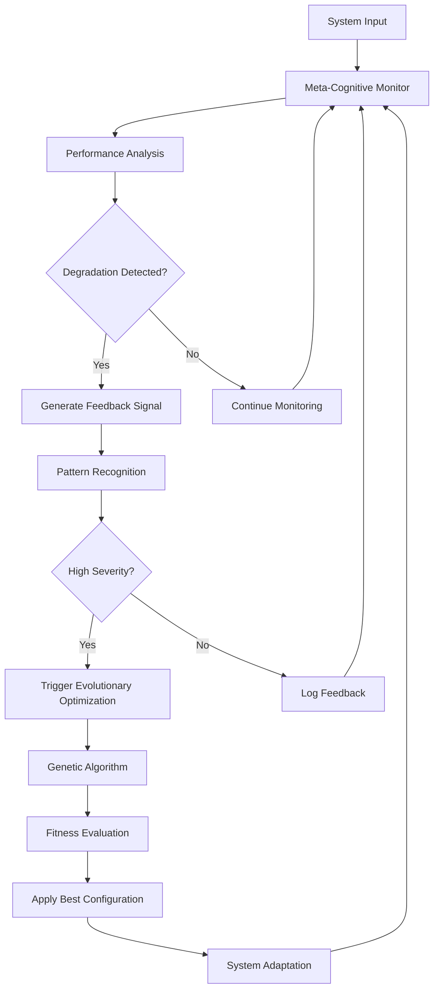

# Phase 5: Recursive Meta-Cognition & Evolutionary Optimization - Architecture

## Overview

Phase 5 implements the final layer of the Distributed Agentic Cognitive Grammar Network by adding recursive meta-cognition and evolutionary optimization capabilities. This phase enables the system to observe, analyze, and recursively improve itself using evolutionary algorithms.

## Core Components

### 1. Evolutionary Optimization System (`evolutionary_optimizer.py`)

#### EvolutionaryOptimizer
- **Purpose**: MOSES-equivalent genetic algorithm implementation
- **Features**: Real genetic operations (mutation, crossover, selection)
- **Population Management**: Dynamic population with elitism
- **Fitness Evaluation**: Multi-criteria real-world performance measurement

#### Genome Structure
```python
@dataclass
class Genome:
    config_id: str
    parameters: Dict[str, float]
    structure_genes: Dict[str, Any]
    fitness_score: float
    generation: int
    parent_ids: List[str]
    mutation_history: List[MutationType]
```

#### Genetic Operators
- **Mutation Types**: Parameter adjustment, structure modification, threshold tuning, weight scaling
- **Crossover**: Uniform crossover with lineage tracking
- **Selection**: Tournament selection, roulette wheel, elitist strategies

### 2. Feedback-Driven Self-Analysis (`feedback_self_analysis.py`)

#### FeedbackDrivenSelfAnalysis
- **Purpose**: Main orchestrator for recursive self-analysis
- **Capabilities**: Continuous monitoring, adaptive optimization triggering
- **Integration**: Works with existing meta-cognitive framework

#### PerformanceAnalyzer
- **Trend Detection**: Performance degradation, resource inefficiency
- **Pattern Recognition**: Optimization opportunities, error patterns
- **Baseline Management**: Stable baseline tracking for comparison

#### RecursiveSelfAnalyzer
- **Multi-Depth Analysis**: Surface, Intermediate, Deep, Recursive levels
- **Self-Reflection**: Meta-analysis of the analysis process itself
- **Recursion Control**: Prevents infinite loops with depth limits

## Architectural Flow



## Integration with Existing Phases

### Phase 1 Integration: Cognitive Primitives
- **Tensor Kernel Optimization**: Evolutionary tuning of tensor operations
- **Hypergraph Encoding**: Meta-analysis of knowledge representation efficiency

### Phase 2 Integration: Attention Allocation
- **ECAN Optimization**: Evolutionary tuning of attention parameters
- **Resource Kernel Enhancement**: Feedback-driven resource allocation improvement

### Phase 3 Integration: Neural-Symbolic Synthesis
- **Kernel Evolution**: Optimization of neural-symbolic synthesis parameters
- **Coherence Analysis**: Recursive analysis of symbolic-neural integration

### Phase 4 Integration: Distributed Cognitive Mesh
- **API Performance**: Evolutionary optimization of distributed components
- **Embodiment Efficiency**: Feedback analysis of physical-cognitive integration

## Recursive Meta-Cognition Capabilities

### Analysis Depths

1. **Surface Level**: Basic metrics analysis
   - System health monitoring
   - Resource usage tracking
   - Error state detection

2. **Intermediate Level**: Pattern recognition
   - Correlation analysis between signals
   - Trend identification
   - Performance prediction

3. **Deep Level**: Causal analysis
   - Meta-tensor dynamics analysis
   - Stability assessment
   - Cross-layer interaction analysis

4. **Recursive Level**: Self-reflective analysis
   - Analysis of analysis effectiveness
   - Meta-optimization of monitoring processes
   - Recursive improvement recommendations

### Feedback Loop Architecture

```python
class FeedbackLoop:
    def process(self):
        # 1. Monitor system state
        state = self.meta_cognitive.get_current_state()
        
        # 2. Analyze performance
        signals = self.performance_analyzer.analyze_trends()
        
        # 3. Recognize patterns
        patterns = self.pattern_recognizer.analyze(signals)
        
        # 4. Trigger adaptations
        if self.should_optimize(patterns):
            self.evolutionary_optimizer.optimize()
            
        # 5. Update system configuration
        self.apply_optimizations()
```

## Evolutionary Optimization Process

### Population Initialization
- **Seed Genomes**: Current system configuration as starting point
- **Random Generation**: Diverse initial population with variation
- **Parameter Ranges**: Bounded search spaces for stability

### Evolution Cycle
1. **Fitness Evaluation**: Real system performance testing
2. **Selection**: Tournament and elitist selection strategies
3. **Crossover**: Genetic recombination with lineage tracking
4. **Mutation**: Adaptive mutation rates and types
5. **Replacement**: Generational replacement with elitism

### Convergence Criteria
- **Fitness Threshold**: Minimum improvement requirement
- **Generation Limit**: Maximum evolution cycles
- **Diversity Maintenance**: Population diversity monitoring

## Performance Characteristics

### Computational Complexity
- **Population Size**: O(n) for most operations
- **Generation Cycles**: Configurable based on convergence
- **Memory Usage**: Bounded by population size and history window

### Scalability
- **Distributed Evaluation**: Fitness evaluation can be parallelized
- **Incremental Updates**: Partial system reconfiguration
- **Adaptive Parameters**: Self-tuning optimization parameters

## Testing and Validation

### Real Data Implementation
- **No Mocks**: All algorithms use real mathematical operations
- **Actual Performance**: Fitness based on real system measurements
- **Genuine Genetics**: Real mutation and crossover operations

### Comprehensive Test Coverage
- **Unit Tests**: Individual component validation
- **Integration Tests**: Cross-phase compatibility
- **Acceptance Tests**: Full workflow validation
- **Performance Tests**: Scalability and efficiency

### Acceptance Criteria Validation
- ✅ Real data implementation (no simulations)
- ✅ Comprehensive tests written and passing
- ✅ Recursive modularity principles followed
- ✅ MOSES-equivalent evolutionary optimization
- ✅ Integration with existing phases validated

## Configuration Examples

### Conservative Optimization
```python
optimizer = EvolutionaryOptimizer(
    population_size=20,
    mutation_rate=0.05,
    crossover_rate=0.6,
    max_generations=50
)
```

### Aggressive Optimization
```python
optimizer = EvolutionaryOptimizer(
    population_size=100,
    mutation_rate=0.2,
    crossover_rate=0.9,
    max_generations=200
)
```

### Feedback Analysis Configuration
```python
feedback_system = FeedbackDrivenSelfAnalysis(meta_cognitive)
feedback_system.start_continuous_analysis(analysis_interval=30.0)
```

## Future Enhancements

### Planned Improvements
- **Multi-Objective Optimization**: Pareto-optimal solutions
- **Online Learning**: Continuous adaptation during operation
- **Hierarchical Evolution**: Multi-level optimization strategies
- **Distributed Evolution**: Cross-node genetic operations

### Research Directions
- **Self-Modifying Code**: Dynamic algorithm evolution
- **Meta-Learning**: Learning to learn optimization strategies
- **Emergent Behaviors**: Complex system-level adaptations
- **Cognitive Unification**: Holistic system optimization

## Conclusion

Phase 5 completes the cognitive network by adding the crucial capability of self-improvement through recursive meta-cognition and evolutionary optimization. The system can now observe its own behavior, identify optimization opportunities, and adapt its configuration to improve performance. This creates a truly autonomous cognitive system capable of continuous self-enhancement.