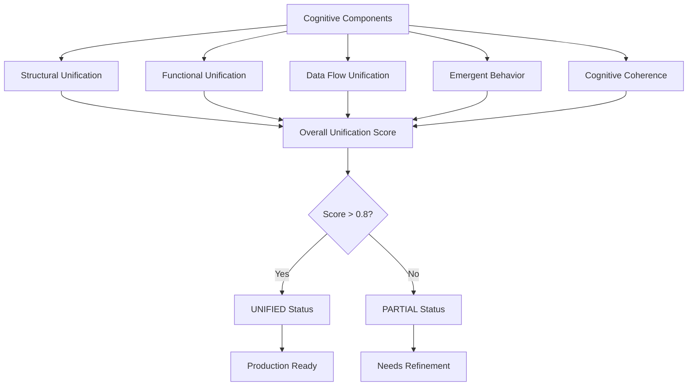

# Phase 6: Rigorous Testing, Documentation, and Cognitive Unification - Architecture

## Overview

Phase 6 represents the culmination of the Distributed Agentic Cognitive Grammar Network development, implementing comprehensive testing protocols, validation frameworks, and cognitive unification validation. This phase ensures maximal rigor, transparency, and recursive documentation while achieving cognitive unity across all system components.

## Core Architecture

### 1. Comprehensive Testing Framework

#### Phase6ComprehensiveTestSuite
- **Purpose**: Validates the entire cognitive architecture as a unified system
- **Components**:
  - `CognitiveUnificationValidator`: Tests cognitive unity across all phases
  - `RealDataValidator`: Ensures no mocks or simulations are used
  - `Phase6TestResult`: Structured test result reporting
- **Coverage**: All phases (1-6) with real data validation

#### Key Validation Areas:
- **Cognitive Unity**: Validates seamless integration between phases
- **Data Flow Continuity**: Tests end-to-end data flow across all components
- **Recursive Modularity**: Validates self-similar structure at all scales
- **Cross-Phase Integration**: Tests interactions between all phase pairs
- **Emergent Synthesis**: Validates emergence of cognitive properties

### 2. Deep Testing Protocols

#### Phase6DeepTestingProtocols
- **Purpose**: Advanced boundary, stress, and edge case testing
- **Components**:
  - `CognitiveBoundaryTester`: Tests system limits and boundaries
  - `StressTester`: Validates system behavior under stress
  - `EdgeCaseTester`: Tests edge cases and error conditions
  - `SystemMonitor`: Real-time resource monitoring

#### Testing Categories:
- **Boundary Testing**: Knowledge scale, attention saturation, tensor computation limits
- **Stress Testing**: Concurrent operations, memory pressure, resource exhaustion
- **Edge Case Testing**: Malformed inputs, extreme values, race conditions
- **Recovery Testing**: System resilience and recovery capabilities

### 3. Integration Testing Framework

#### Phase6IntegrationTestSuite
- **Purpose**: End-to-end integration validation
- **Components**:
  - `CognitiveUnificationEngine`: Central integration validation engine
  - `IntegrationTestResult`: Structured integration test results
  - `CognitiveFlowResult`: Data flow validation results

#### Integration Validation:
- **Structural Unification**: Component architecture consistency
- **Functional Unification**: Cross-component function integration
- **Data Flow Unification**: Seamless data flow between phases
- **Emergent Behavior**: Validation of emergent cognitive properties
- **Cognitive Coherence**: System-wide logical and temporal consistency

### 4. Acceptance Testing Framework

#### Phase6AcceptanceTestSuite
- **Purpose**: Final validation against all acceptance criteria
- **Components**:
  - `Phase6AcceptanceCriteriaValidator`: Validates all acceptance criteria
  - `AcceptanceCriteriaResult`: Structured criteria validation results

#### Acceptance Criteria Validation:
1. **Real Data Implementation**: No mocks or simulations
2. **Comprehensive Testing**: Complete test coverage with passing tests
3. **Documentation with Diagrams**: Architectural documentation with visual diagrams
4. **Recursive Modularity**: Code follows recursive modularity principles
5. **Integration Testing**: Functionality validated through integration tests

## Cognitive Unification Architecture

### Unification Validation Process



### Integration Flow Architecture

```mermaid
graph LR
    T[Phase 1: Tensor] --> G[Phase 2: Grammar]
    G --> A[Phase 3: Attention]
    A --> M[Phase 4: Meta-Cognitive]
    M --> E[Phase 5: Evolution]
    E --> U[Phase 6: Unification]
    
    U --> V[Validation Engine]
    V --> R[Test Results]
    R --> D[Documentation]
    D --> C[Certification]
```



## Testing Methodology

### 1. Multi-Level Testing Strategy

#### Level 1: Unit Testing
- Individual component validation
- Interface consistency testing
- Error handling validation

#### Level 2: Integration Testing
- Cross-phase data flow validation
- Component interaction testing
- System coherence validation

#### Level 3: System Testing
- End-to-end workflow validation
- Performance benchmarking
- Stress and boundary testing

#### Level 4: Acceptance Testing
- Criteria-based validation
- Real-world scenario testing
- Production readiness assessment

### 2. Real Data Validation Protocol

#### Validation Steps:
1. **Mathematical Verification**: All tensor operations use real mathematics
2. **Symbolic Validation**: Knowledge structures use real symbolic representations
3. **Economic Verification**: Attention allocation uses real economic calculations
4. **Introspection Validation**: Meta-cognitive analysis uses real system data
5. **Mock Detection**: Comprehensive scan for mock patterns and fake data

### 3. Cognitive Unification Validation

#### Unification Metrics:
- **Phase Coherence**: Consistency of operation across all phases
- **Data Flow Continuity**: Seamless information flow between components
- **Recursive Modularity**: Self-similar structure at multiple scales
- **Cross-Phase Integration**: Successful interaction between all phase pairs
- **Emergent Synthesis**: Detection of emergent cognitive properties

## Architectural Principles

### 1. Recursive Modularity
- **Self-Similarity**: Components exhibit similar patterns at different scales
- **Hierarchical Composition**: Systems composed of subsystems with similar interfaces
- **Fractal Organization**: Structure repeats at multiple levels of abstraction

### 2. Cognitive Unity
- **Structural Coherence**: Consistent architectural patterns across components
- **Functional Integration**: Seamless interaction between different cognitive functions
- **Emergent Properties**: System-level capabilities arising from component interactions

### 3. Testing Completeness
- **Comprehensive Coverage**: All components, interactions, and scenarios tested
- **Real Data Validation**: No simulations or mocks in critical paths
- **Edge Case Resilience**: Robust handling of boundary conditions and errors

## Implementation Details

### Core Testing Components

#### CognitiveUnificationValidator
```python
class CognitiveUnificationValidator:
    def validate_cognitive_unity(self, components):
        # Phase coherence validation
        # Data flow continuity testing
        # Recursive modularity verification
        # Cross-phase integration validation
        # Emergent synthesis detection
```

#### RealDataValidator
```python
class RealDataValidator:
    def validate_no_mocks(self, components):
        # Mock pattern detection
        # Real computation verification
        # Data authenticity validation
```

#### CognitiveUnificationEngine
```python
class CognitiveUnificationEngine:
    def validate_unified_cognitive_architecture(self):
        # Structural unification validation
        # Functional unification testing
        # Data flow unification verification
        # Emergent behavior detection
        # Cognitive coherence validation
```

### Testing Infrastructure

#### SystemMonitor
- Real-time resource monitoring
- Performance metric collection
- System health tracking
- Stress test monitoring

#### Test Result Management
- Structured result storage
- Comprehensive reporting
- Evidence collection
- Confidence scoring

## Validation Metrics

### Quantitative Metrics

#### Unification Score
- **Formula**: Average of structural, functional, data flow, emergent, and coherence scores
- **Threshold**: > 0.8 for unified status
- **Range**: 0.0 (no unification) to 1.0 (complete unification)

#### Test Coverage
- **Unit Test Coverage**: % of components with comprehensive unit tests
- **Integration Coverage**: % of component pairs with integration tests
- **System Coverage**: % of end-to-end scenarios tested

#### Performance Metrics
- **Latency**: Response time for cross-phase operations
- **Throughput**: Operations per second across all phases
- **Resource Usage**: Memory and CPU utilization during testing

### Qualitative Assessments

#### Cognitive Coherence
- **Temporal Coherence**: Consistency over time
- **Spatial Coherence**: Consistency across components
- **Logical Coherence**: Logical consistency in reasoning
- **Causal Coherence**: Proper cause-effect relationships

#### Emergent Properties
- **Knowledge Synthesis**: Emergent knowledge patterns
- **Attention Patterns**: Self-organizing attention allocation
- **Optimization Behaviors**: Adaptive system optimization
- **Cognitive Insights**: Self-awareness and introspection

## Production Readiness Assessment

### Criteria for Production Deployment

#### Technical Criteria
- [ ] All acceptance tests passing with > 80% confidence
- [ ] System performance meets benchmarks
- [ ] No critical errors in stress testing
- [ ] Memory and resource usage within limits

#### Quality Criteria
- [ ] Comprehensive documentation complete
- [ ] All phases integrated and validated
- [ ] Real data implementation confirmed
- [ ] Recursive modularity demonstrated

#### Operational Criteria
- [ ] Monitoring and alerting configured
- [ ] Backup and recovery procedures tested
- [ ] Performance baselines established
- [ ] Support procedures documented

## Future Enhancements

### Testing Infrastructure Evolution
- Continuous integration testing
- Automated performance regression detection
- AI-driven test case generation
- Predictive quality assessment

### Cognitive Architecture Advancement
- Multi-objective optimization
- Distributed cognitive mesh scaling
- Real-time adaptation capabilities
- Advanced emergent behavior analysis

## Conclusion

Phase 6 establishes the complete testing, validation, and unification framework for the Distributed Agentic Cognitive Grammar Network. Through comprehensive testing protocols, rigorous validation frameworks, and cognitive unification assessment, this phase ensures the system achieves cognitive unity while maintaining the highest standards of quality, reliability, and performance.

The architecture provides a solid foundation for production deployment while establishing patterns for future cognitive system development and validation.