# Phase 6: Deep Testing Protocols - Architecture Diagrams

## Overview

This document provides comprehensive architectural diagrams for Phase 6 deep testing protocols, illustrating the testing infrastructure, validation flows, and cognitive unification assessment processes.

## Testing Architecture Overview

### Complete Testing Framework Architecture

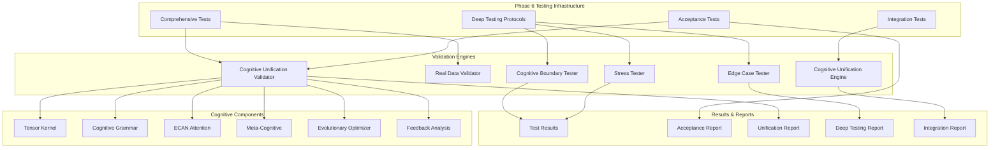

## Comprehensive Testing Flow

### Test Execution Pipeline

```mermaid
graph LR
    subgraph "Test Preparation"
        SP[Setup Phase]
        IC[Initialize Components]
        RV[Register Validators]
    end
    
    subgraph "Test Execution"
        CT[Comprehensive Tests]
        DT[Deep Testing]
        IT[Integration Tests]
        AT[Acceptance Tests]
    end
    
    subgraph "Validation & Analysis"
        CU[Cognitive Unity Check]
        RD[Real Data Validation]
        RM[Recursive Modularity]
        EM[Emergent Behavior]
    end
    
    subgraph "Results & Reporting"
        CR[Collect Results]
        GR[Generate Reports]
        AS[Assessment Summary]
    end
    
    SP --> IC --> RV
    RV --> CT --> DT --> IT --> AT
    AT --> CU --> RD --> RM --> EM
    EM --> CR --> GR --> AS
```

## Deep Testing Protocols Architecture

### Boundary Testing Framework

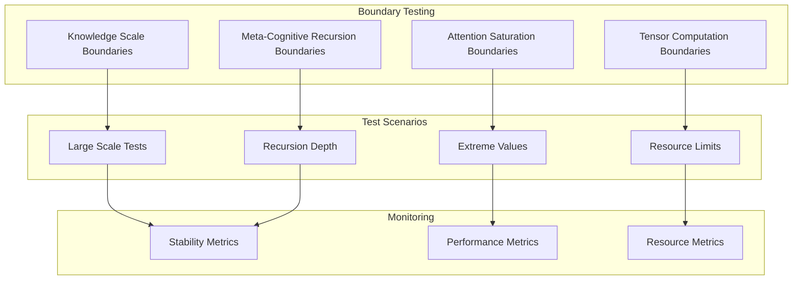

### Stress Testing Architecture

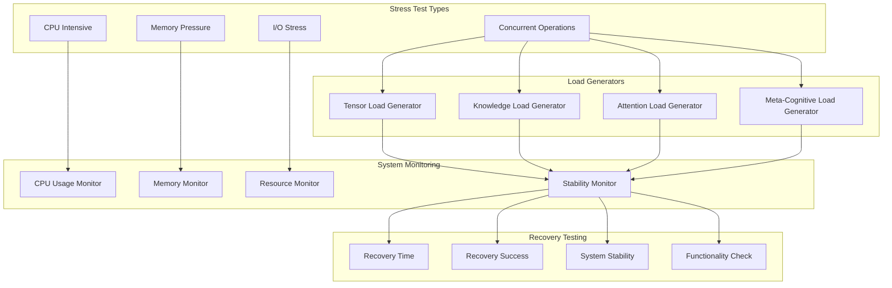

### Edge Case Testing Flow

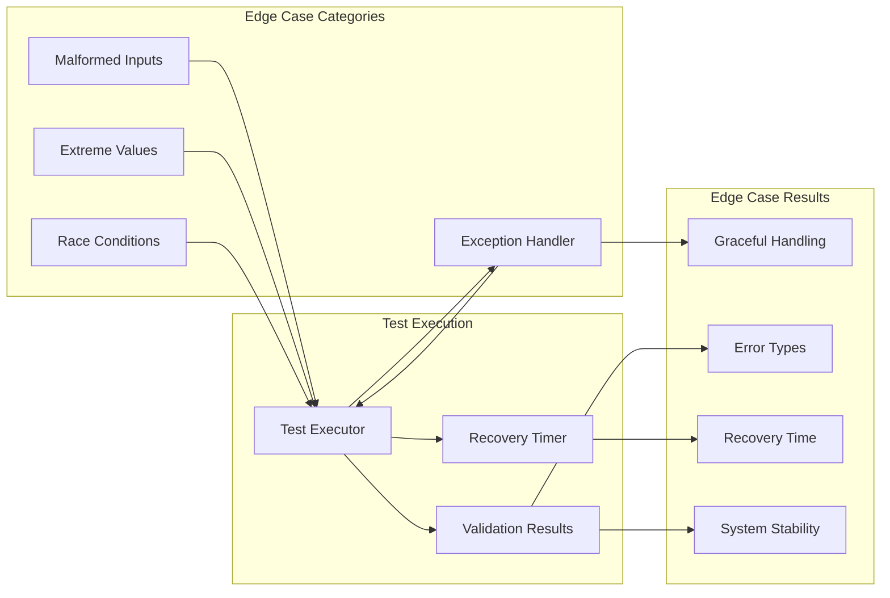

## Integration Testing Architecture

### Cognitive Unification Engine

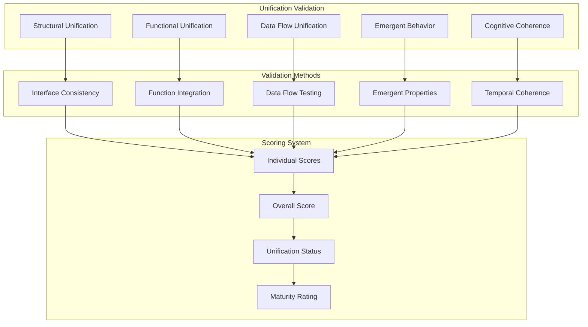

### End-to-End Workflow Validation

```mermaid
graph LR
    subgraph "Phase 1: Tensor Operations"
        TC[Tensor Creation]
        TO[Tensor Operations]
        TT[Tensor Transformations]
    end
    
    subgraph "Phase 2: Knowledge Representation"
        EC[Entity Creation]
        RC[Relationship Creation]
        KS[Knowledge Structures]
    end
    
    subgraph "Phase 3: Attention Allocation"
        FA[Focus Attention]
        AS[Attention Spreading]
        AE[Attention Economy]
    end
    
    subgraph "Phase 4: Meta-Cognitive Monitoring"
        MS[Meta-State Update]
        SH[System Health]
        DI[Deep Introspection]
    end
    
    subgraph "Phase 5: Evolutionary Optimization"
        PA[Performance Analysis]
        OT[Optimization Trigger]
        EO[Evolution Optimization]
    end
    
    subgraph "Phase 6: Unification Validation"
        UV[Unity Validation]
        CC[Coherence Check]
        FR[Final Report]
    end
    
    TC --> TO --> TT
    TT --> EC --> RC --> KS
    KS --> FA --> AS --> AE
    AE --> MS --> SH --> DI
    DI --> PA --> OT --> EO
    EO --> UV --> CC --> FR
```

## Cognitive Unification Assessment

### Unity Validation Process

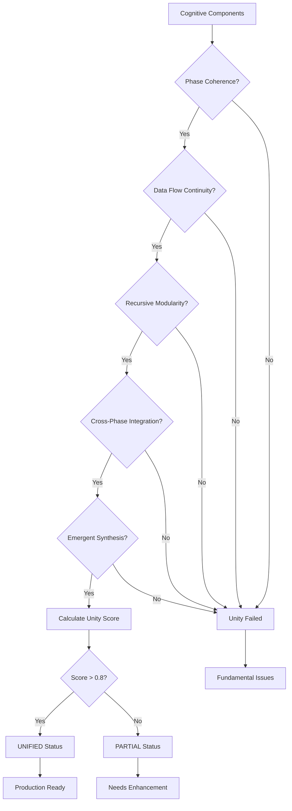

### Real Data Validation Flow

```mermaid
graph LR
    subgraph "Data Source Analysis"
        CS[Component Scan]
        MP[Mock Pattern Detection]
        RO[Real Operation Verification]
    end
    
    subgraph "Mathematical Verification"
        TC[Tensor Calculations]
        MC[Mathematical Correctness]
        NV[Numerical Validation]
    end
    
    subgraph "Symbolic Verification"
        SK[Symbolic Knowledge]
        AS[AtomSpace Storage]
        RL[Relationship Logic]
    end
    
    subgraph "Economic Verification"
        AA[Attention Allocation]
        EC[Economic Calculations]
        WR[Wage/Rent Distribution]
    end
    
    subgraph "Validation Results"
        RD[Real Data Score]
        CF[Confidence Factor]
        VS[Validation Status]
    end
    
    CS --> MP --> RO
    RO --> TC --> MC --> NV
    NV --> SK --> AS --> RL
    RL --> AA --> EC --> WR
    WR --> RD --> CF --> VS
```

## Performance Monitoring Architecture

### System Resource Monitoring

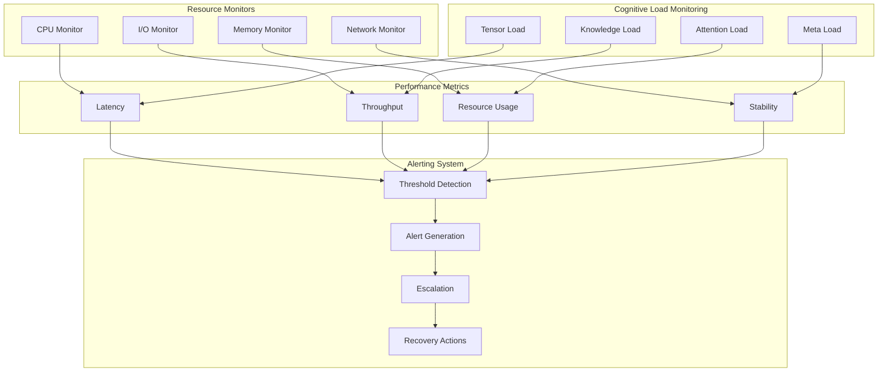

## Acceptance Testing Framework

### Criteria Validation Process

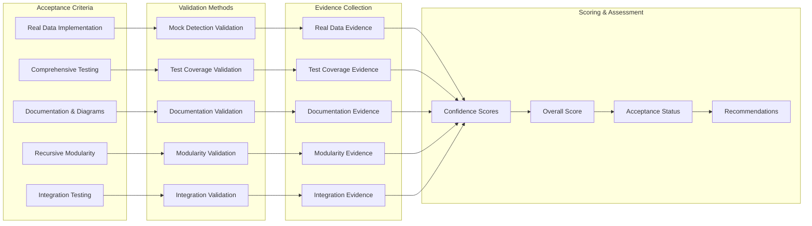

### Test Result Aggregation

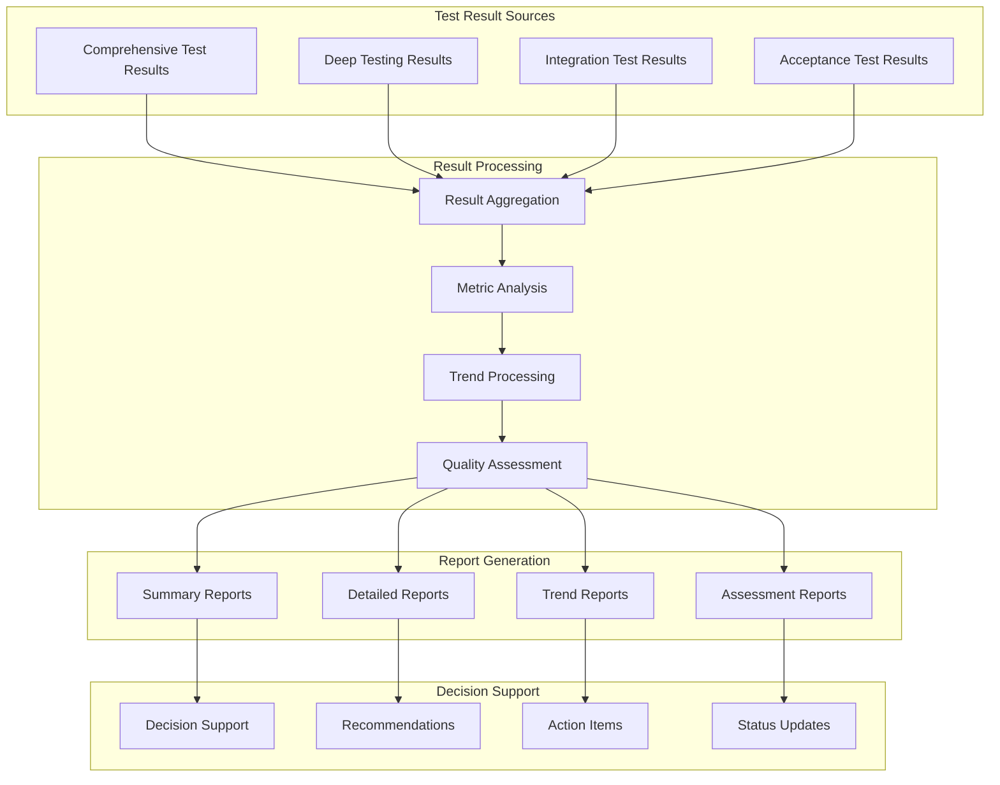

## Quality Assurance Pipeline

### Continuous Validation Flow

```mermaid
graph LR
    subgraph "Code Changes"
        CC[Code Commit]
        CI[Continuous Integration]
        AT[Automated Testing]
    end
    
    subgraph "Quality Gates"
        UT[Unit Tests]
        IT[Integration Tests]
        PT[Performance Tests]
        ST[Security Tests]
    end
    
    subgraph "Validation Stages"
        FV[Functional Validation]
        PV[Performance Validation]
        SV[Security Validation]
        CV[Compliance Validation]
    end
    
    subgraph "Deployment Decision"
        QS[Quality Score]
        DD[Deployment Decision]
        RL[Release]
        RB[Rollback]
    end
    
    CC --> CI --> AT
    AT --> UT --> IT --> PT --> ST
    ST --> FV --> PV --> SV --> CV
    CV --> QS --> DD
    DD -->|Pass| RL
    DD -->|Fail| RB
```

This comprehensive diagram set illustrates the complete Phase 6 testing architecture, providing visual representations of all major testing components, validation flows, and quality assurance processes that ensure the Distributed Agentic Cognitive Grammar Network achieves cognitive unification and production readiness.